# CR380 — Podman Lab

> **FR** : Suite de tests automatisés et tutoriels interactifs pour apprendre [Podman](https://podman.io/) et [Podman Compose](https://github.com/containers/podman-compose) dans le cadre du cours CR380 — *Introduction aux conteneurs* à Polytechnique Montréal.
>
> **EN**: Automated test suite and interactive tutorials for learning [Podman](https://podman.io/) and [Podman Compose](https://github.com/containers/podman-compose) as part of the CR380 — *Introduction to Containers* course at Polytechnique Montréal.

Podman est un moteur de conteneurs **sans démon** et **rootless** compatible avec Docker. Ce dépôt contient **9 labs progressifs** (00–08) plus un nettoyage final (99).

Podman is a **daemonless** and **rootless** container engine compatible with Docker. This repository contains **9 progressive labs** (00–08) plus a final teardown (99).

---

## Démarrage rapide / Quick Start

```bash
# Mode interactif étudiant — explications bilingues, pauses entre les étapes
# Interactive student mode — bilingual explanations, pauses between steps
./run-labs.sh --learn

# Mode validation enseignant — rapide, silencieux, résumé à la fin
# Teacher validation mode — fast, quiet, summary at end
./run-labs.sh --validate

# Exécuter un seul lab / Run a single lab
./run-labs.sh --learn --lab 03
```

> **Prérequis / Prerequisites** : Ubuntu 22.04+ (amd64), connexion Internet, 10 Go+ d'espace disque libre.
> Voir le [cloud-init](cloud-init/) pour la configuration de la VM / See [cloud-init](cloud-init/) for VM setup.

---

## Progression des labs / Lab Progression

Les labs sont organisés en **4 phases d'apprentissage**. Chaque lab dépend du précédent.

The labs are organized into **4 learning phases**. Each lab depends on the previous one.

```mermaid
graph LR
    subgraph "🔧 Phase 1 — Installation et configuration / Setup"
        L00["00 · Preflight"]
        L01["01 · Installation<br/>Podman"]
        L02["02 · Post-installation"]

        L00 --> L01 --> L02
    end

    subgraph "📦 Phase 2 — Conteneurs et images / Containers & Images"
        L03["03 · Premiers conteneurs<br/>First Containers"]
        L04["04 · Images &amp; Registres<br/>Images & Registries"]
        L05["05 · Containerfile<br/>Image Build"]

        L02 --> L03 --> L04 --> L05
    end

    subgraph "🏗️ Phase 3 — Fonctionnalités avancées / Advanced"
        L06["06 · Volumes &amp;<br/>Persistance"]
        L07["07 · Pods<br/>(Podman unique)"]

        L05 --> L06 --> L07
    end

    subgraph "🔗 Phase 4 — Podman Compose"
        L08["08 · Podman Compose"]

        L07 --> L08
    end

    L99["99 · Nettoyage final<br/>Final Teardown"]
    L08 -.->|cleanup| L99

    style L00 fill:#e8f5e9
    style L07 fill:#fff3e0
    style L08 fill:#e3f2fd
    style L99 fill:#ffebee
```



---

## Résumé des labs / Lab Summary

| # | Lab | Description FR | Description EN | Commande clé / Key Command |
|---|-----|---------------|----------------|---------------------------|
| 00 | **Preflight** | Vérifier OS, réseau, disque, outils | Verify OS, network, disk, tools | — |
| 01 | **Installation** | Installer Podman via APT | Install Podman via APT | `sudo apt-get install -y podman` |
| 02 | **Post-installation** | Vérifier l'installation, mode rootless | Verify install, rootless mode | `podman info` |
| 03 | **Premiers conteneurs** | podman run, exec, stop, rm, ports | podman run, exec, stop, rm, ports | `podman run -d --name nginxCT -p 8080:80 nginx` |
| 04 | **Images & Registres** | Rechercher, télécharger, inspecter les images | Search, pull, inspect images | `podman pull docker.io/alpine` |
| 05 | **Containerfile** | Construire une image personnalisée | Build a custom image | `podman build -t monimage:base -f containerfiles/containerfile-base .` |
| 06 | **Volumes** | Créer un volume, bind mount, persistance | Create volume, bind mount, persistence | `podman volume create podman_data` |
| 07 | **Pods** | Créer des pods (concept Kubernetes) | Create pods (Kubernetes concept) | `podman pod create --name mypod -p 8082:80` |
| 08 | **Podman Compose** | Orchestrer plusieurs conteneurs | Orchestrate multiple containers | `podman-compose -f compose-files/nginx-basic.yaml up -d` |
| 99 | **Nettoyage** | Tout supprimer et repartir à zéro | Delete everything and start fresh | `./run-labs.sh --lab 99` |

---

## Podman vs Docker

| Fonctionnalité / Feature | Docker | Podman |
|--------------------------|--------|--------|
| Démon / Daemon | ✅ Requis | ❌ Pas de démon |
| Rootless | ⚠️ Configuré | ✅ Par défaut |
| Pods | ❌ Non | ✅ Oui |
| YAML Kubernetes | ❌ Non | ✅ `podman generate kube` |
| Compose | `docker compose` | `podman-compose` |
| CLI compatible | — | ✅ Quasiment identique |

---

## Comprendre les résultats / Understanding Results

```
✓  Test réussi / Test passed
✗  Test échoué / Test failed — lisez le HINT / read the HINT
⊘  Test ignoré / Test skipped — dépendance non satisfaite / unmet dependency
```

---

## Modes d'exécution / Execution Modes

| Drapeau / Flag | Mode | Description |
|----------------|------|-------------|
| `--validate` | Enseignant / Teacher | Exécution rapide, résumé à la fin / Fast run, summary at end |
| `--learn` | Étudiant / Student | Explications bilingues, pause entre chaque étape / Bilingual explanations, pause between steps |
| `--lab NN` | Lab unique / Single lab | Exécuter uniquement le lab NN / Run only lab NN |
| `--reset NN` | Réinitialisation / Reset | Nettoyer puis réexécuter le lab NN / Clean then rerun lab NN |
| `--quick` | Rapide / Quick | Sauter install si Podman est déjà présent / Skip install if Podman present |
| `--diff` | Comparaison / Compare | Comparer les 2 derniers rapports JSON / Compare last 2 JSON reports |
| `--verbose` | Verbeux / Verbose | Afficher toutes les sorties / Show all output |

---

## Structure du projet / Project Structure

```
CR380-podman-lab/
├── run-labs.sh               # Lanceur principal / Master runner
├── run-teacher-validation.sh # Validation enseignant / Teacher validation
├── config.env                # Configuration centrale / Central config
├── tests/
│   ├── _common.sh            # Framework de test / Test framework
│   ├── 00-preflight.sh       # Vérifications préalables
│   ├── 01-install.sh         # Installation Podman
│   ├── 02-post-install.sh    # Post-installation
│   ├── 03-first-containers.sh # Premiers conteneurs
│   ├── 04-images.sh          # Images & Registres
│   ├── 05-containerfile.sh   # Containerfile & Build
│   ├── 06-volumes.sh         # Volumes & Persistance
│   ├── 07-pods.sh            # Pods
│   ├── 08-compose.sh         # Podman Compose
│   └── 99-teardown.sh        # Nettoyage final
├── containerfiles/
│   ├── containerfile-base    # Lab 05 — Image de base
│   └── index.html            # Page HTML copiée dans l'image
├── compose-files/
│   └── nginx-basic.yaml      # Lab 08 — Service Nginx simple
├── gitbook/                  # Documentation GitBook bilingue
├── cloud-init/
│   ├── user-data-fresh.yaml  # VM propre / Clean VM
│   └── provision-multipass.sh # Lanceur Multipass
├── results/                  # Rapports JSON (auto-générés)
└── logs/                     # Journaux détaillés (auto-générés)
```

---

## Licence / License

Ce projet est utilisé à des fins pédagogiques dans le cadre du cours CR380 à Polytechnique Montréal.

This project is used for educational purposes as part of the CR380 course at Polytechnique Montréal.
Discovery and introduction to podman
